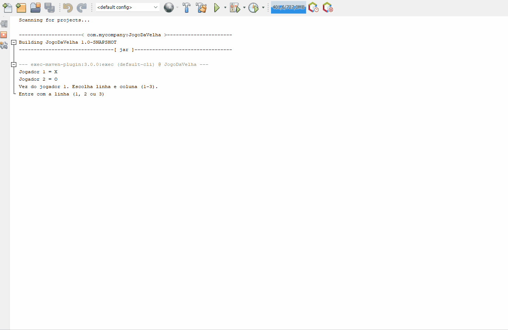

# Sobre o Projeto 🚀

Projeto desenvolvido utilizando os fundamentos de Matrizes Tridimensionais em JAVA, com a finalidade didática no aprendizado na linguagem.

# Tecnologias Utilizadas

Foi utilizado apenas a linguagem JAVA

# Tela de Aplicação 

